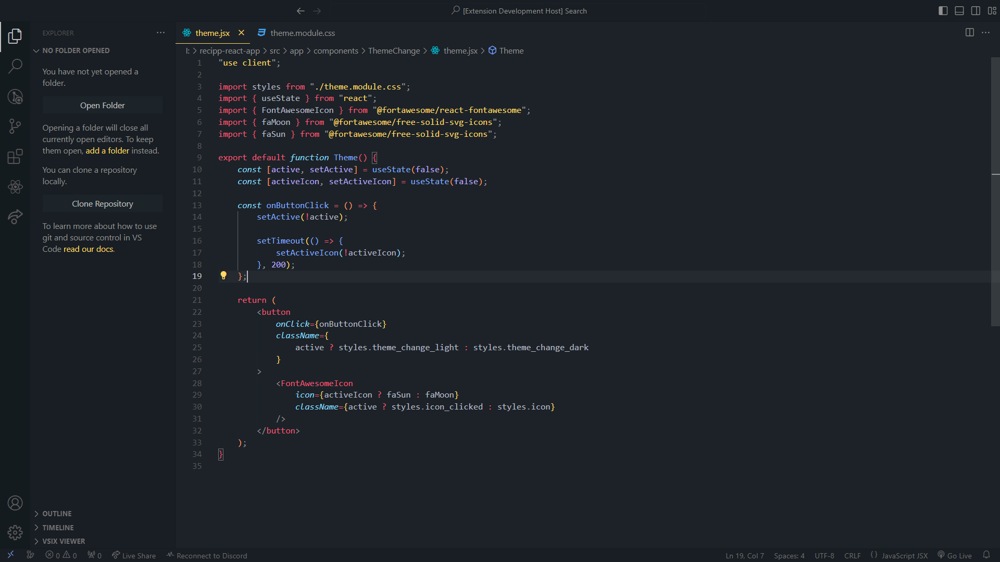

# Herb's Themes for Visual Studio Code

---

Crafted with passion from one coder to another, inspired by the timeless allure of Monokai, perfect for those who find solace in late-night coding sessions.

Features:

-   **Complete:** Every single component has been customised.
-   **Dark:** It's darker than the usual Monokai themes so it won't attract bugs when you're coding!
-   **Supported:** You can expect frequent updated, as well as some new sub-themes in the future!

#### Install

You can choose to do one of the following:

-   Extensions ‣ Search for 'Herb's Themes' ‣ Install
-   Command Palette ‣ Herb's Themes: select theme
-   Ctrl + Shift + P ‣ Preferences: Color Theme ‣ Herb's Theme

Link to VSCode marketplace can be found [here](https://marketplace.visualstudio.com/items?itemName=herbchan.herbstheme).

#### DemoName: Herb's Theme

#### Github

If you like the theme you can visit my repositorium [here](https://github.com/herb-chan/herb-s-theme). You can also leave a star if you'd like!

#### License

MIT © herbchan
